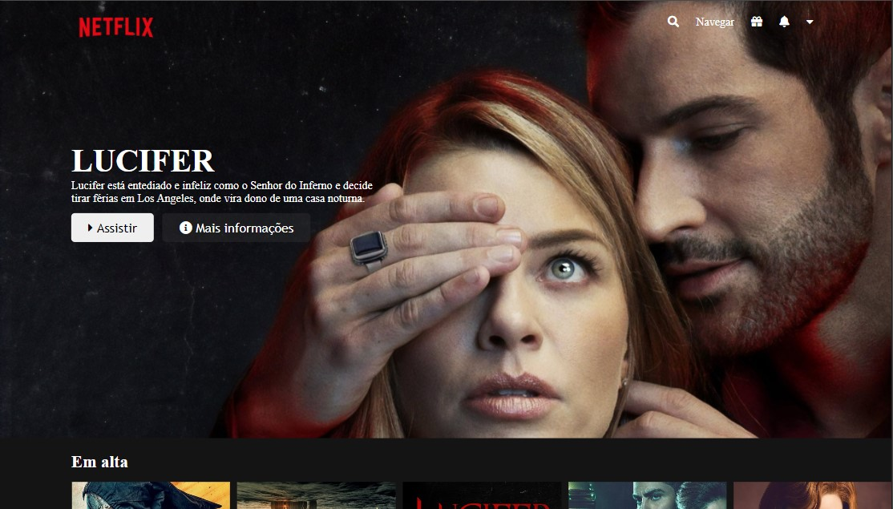

## pageNetflixClone
Fala Dev's, 
Como vão ?
Dessa vez, realizei o clone da Página inicial da Netflix.

## Tecnologias/Bibliotecas usadas no Projeto:

-CSS3
-HTML5
-SASS
-Plugin Jquery 
-Biblioteca Own Carrossel (Responsável pelo efeito de rolagem dos filmes)

